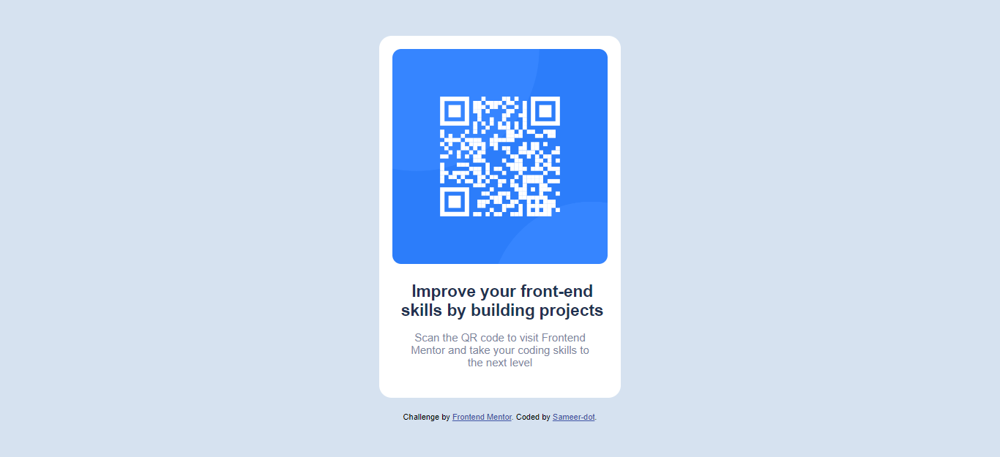

# Frontend Mentor - QR code component solution

This is a solution to the [QR code component challenge on Frontend Mentor](https://www.frontendmentor.io/challenges/qr-code-component-iux_sIO_H). Frontend Mentor challenges help you improve your coding skills by building realistic projects. 

## Table of contents

- [Overview](#overview)
  - [Screenshot](#screenshot)
  - [Links](#links)
  - [Built with](#built-with)
  - [Author](#author)

## Overview
A very simple challenge on Frontend Mentor. The challenge is to make a simple QR-Code component by using HTML/CSS or any library/framework.

### Screenshot

### Links

- Solution URL: [Add solution URL here](https://github.com/Sameer-dot/qr-code-component.git)
- Live Site URL: [Add live site URL here](https://sameerdot-qrcode.netlify.app/)

### Built with

- Semantic HTML5 markup
- CSS custom properties
- Flexbox
- Mobile-first workflow

## Author

- Frontend Mentor - [@Sameer-dot](https://www.frontendmentor.io/profile/Sameer-dot)

